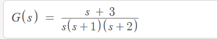
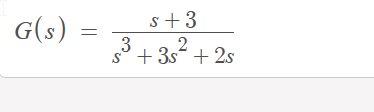

# Transfer-function-bode-plotter

#### It requires libraries: matplotlib and scipy

To install them, run:
  
<code> pip install matplotlib scipy</code>

  

> The given tranfer function should be in expanded form.
num = coefficients of respective powers at numerator,
den = coefficients of respective powers at denomenator,
Go upto the power = 0

---

Example:

    

---

>In the above equation,
num = [1,3]
den = [1,3,2,0]
